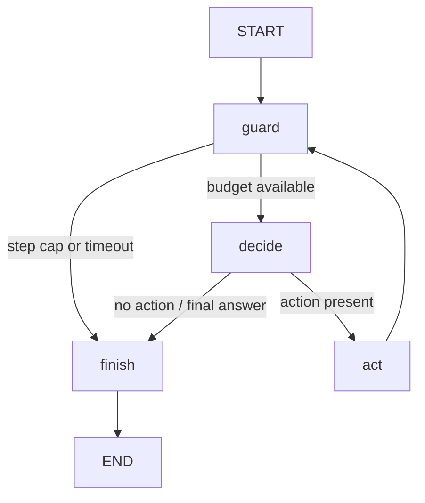

# Week 13 — LangGraph loop lab

Week 5's deterministic agent behavior, expressed as a compiled `StateGraph`. The Week 5 model, read-only mock tools, observation/trace types and tool-error adapter are imported through a local path dependency. The hand-written `run_agent` loop is **not** called by the implementation; tests use it as a behavior oracle. No LLM, API key, device, database, checkpoint, resume or approval service is used.

## Run

From this directory, with Python 3.12+ and uv:

```powershell
uv sync --dev
uv run pytest tests/test_graph.py -k parity
uv run pytest
uv run langgraph-loop-lab
uv run langgraph-loop-lab "Diagnose host web01"
uv run langgraph-loop-lab "Diagnose host web01" --stubborn --max-steps 3
uv run langgraph-loop-lab "Diagnose host web01" --timeout 0
uv run langgraph-loop-lab --diagram
```

No-argument mode demonstrates multi-step diagnosis, down/unknown host early stop, unexpected tool failure, single-tool/no-tool answers, max steps and timeout. `--diagram` prints Mermaid generated directly from the compiled graph without contacting an image-rendering service. Open [docs/agent-state-graph.mmd](docs/agent-state-graph.mmd) in a Mermaid viewer; its contents are compared with the compiled graph by a test. The module entry point `uv run python -m langgraph_loop_lab` works too. Dependency installation may access the package index; execution uses only local mocks and disables LangSmith tracing for the public runner.

## State graph



`guard` and `decide` have conditional outgoing edges only. `act` and `finish` have fixed outgoing edges only. The actual selected destination is returned in `next_node`, consumed by the routing function and recorded in `NodeEvent`. No node accidentally schedules both fixed and conditional successors. START/END are framework sentinels, not executing business nodes.

`AgentState` holds the question, budgets/start time, current decision, completed tool count, observations, tool steps, node events and final outcome. Scalar fields are replaced by partial updates. `history`, `steps` and `events` use `Annotated[list[...], operator.add]`: a node returns only its new entries, and the reducer appends them to accumulated state. Nodes do not append to the incoming state lists. Models receive the accumulated observations. Every public call starts a new state; no durable memory is created.

### One state update

For `Diagnose host web01`, after `guard -> decide -> act` has executed once:

```text
Before act: completed_steps=0, history=[], steps=[]
decision.action=get_host_status, decision.action_input={host: web01}

act returns only:
  completed_steps: 1
  history: [Observation(get_host_status, result={host: web01, status: up, latency_ms: 12})]
  steps: [AgentStep(step_number=1, action=get_host_status, ...)]
  events: [NodeEvent(node=act, next_node=guard, completed_steps=1, history_size=1, ...)]
  next_node: guard

After reducer merge: the observation and step are appended; earlier guard/decide
events remain; question, budgets and decision are preserved without being returned.
The next decide sees history length 1 and selects get_docker_status.
```

### Read the trace

```text
node[01] guard -> decide | steps=0 history=0 | budget available
node[02] decide -> act | steps=0 history=0 | start diagnosis: ...
node[03] act -> guard | steps=1 history=1 | get_host_status
...
node[11] decide -> finish | steps=3 history=3 | all checks complete, ...
node[12] finish -> __end__ | steps=3 history=3 | final_answer
```

Each `node[...]` line names the node that just executed and the next selected edge. For example, line 03 locates execution at `act`, with `guard` scheduled next. The accompanying tool trace records thought/action/input/result/error in the same imported `AgentStep` type as Week 5; CLI prints its action/input/result/error, with decision thought on the node line. `GraphRun.trace` is a Week 5 `AgentTrace`; `GraphRun.state` exposes accumulated state and `GraphRun.events` the additional node trace. These are post-execution records, not a live debugger/checkpoint.

## Matching Week 5

- An up host runs status, docker, alert checks and then answers. A down or unknown host stops after status. A no-tool question answers directly; single-tool questions call once and then answer.
- The existing private `_execute_action` helper is intentionally reused to retain identical unknown-tool, validation, known execution-error and unexpected-error observations. This narrow coupling is documented and protected by parity tests; Week 5 is not copied or modified.
- `max_steps` caps decision/action iterations, **not graph nodes**. Three diagnosis tool calls with `max_steps=3` end at `max_steps_reached`; a fourth allowed decision is needed to produce the final answer. Nonpositive step caps execute no model/tool calls, as in Week 5.
- Timeout is checked before each permitted decision. Once the last allowed tool step completes, the step cap wins without another timeout check. A final answer's elapsed time is measured after the decision; timeout returns the elapsed value of the failing guard. Tests inject the same clock sequences into both implementations and compare full traces, including elapsed time.
- Timeout is cooperative, not preemption: a slow synchronous model/tool is not interrupted mid-call. Graph compilation occurs before timing starts; real runtime overhead differs from the manual loop.
- The graph recursion limit is set to `3 * max(0, max_steps) + 5` so graph scheduling does not prematurely replace the Week 5 step-limit stop reason. A 30-step stubborn-model regression exceeds LangGraph's usual default recursion allowance.

## When the graph helps

During diagnosis, named `guard`, `decide`, `act`, `finish` nodes make the active stage and route inspectable. Shared reducer state lets tests inspect each node's delta separately from accumulated observations. If a future exercise adds distinct validation or escalation stages, explicit edges provide a useful overview and an execution trace that maps back to the diagram.

For a status-only CLI, Week 5's small loop is easier to read, install and debug: one model decision, one tool call and a final decision need little orchestration. Even this four-node graph has more state fields and framework overhead than the original loop. LangGraph organizes control flow and state updates; it does not make the mock model smarter, improve diagnostics or make blocking tools interruptible. Persistence and recovery remain separate future exercises.

## Sources and boundaries

API design follows the current [official Graph API](https://docs.langchain.com/oss/python/langgraph/graph-api): compile a typed state graph, return partial updates, accumulate list channels with a reducer and route with conditional edges. The lock records the exact resolved runtime. The repository's Week 5 package supplies domain behavior; this project supplies graph orchestration. LangGraph transitively installs runtime/checkpoint libraries, but this lab never configures a checkpointer or writes graph state to storage. Library consumers invoking `build_graph()` directly should also disable tracing if their environment enables it.
