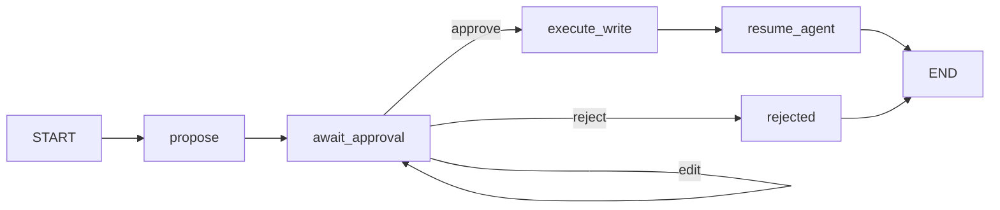

# Week 15 — Human-in-the-loop Write Tool Approval

A deterministic, offline LangGraph exercise implementing the repo's first
Write Tool, `restart_service(service)`, behind a human approval gate:

```text
Agent Proposal -> Human Approval -> { Approve -> Execute | Reject }
```

Read Tools (`get_host_status`, `list_services`) auto-execute inside the
agent flow. Every Write Tool path pauses at an `interrupt()` until a human
decides `approve` / `reject` / `edit`. An edited proposal re-enters
approval as a new version — it can never execute on the earlier approval.
Approval executes the mock backend exactly once — enforced by an atomic
SQLite transaction, not by hoping no crash happens — and resumes the Agent
flow with the outcome as an observation. Every proposal, decision, and
execution result/failure lands in a crash-idempotent Audit Log.

The backend is a **mock** — its "restart" is a durable
`mock_service_state` counter in SQLite. No network, no real service
control, no credentials, no subprocess.

> **Exactly-once scope.** The atomic claim-then-apply guarantee below is a
> property of this *transactional mock* only. A real external service
> cannot join a local SQLite transaction: a crash after the local commit
> but before the remote call completes is unrecoverable by this design.
> Real deployments need the service itself to be idempotent (idempotency
> keys honored server-side) or an outbox/reconciliation protocol — the
> boundary Week 14 already documented. Nothing in this lab tests that
> class of system.

## Run

From this directory, with Python 3.12+ and uv:

```powershell
uv sync --dev
uv run pytest
uv run human-in-the-loop-lab --host web01 start
uv run human-in-the-loop-lab inspect
uv run human-in-the-loop-lab reject        # or: approve | edit --service postgres
uv run human-in-the-loop-lab audit
```

Each subcommand opens its own SQLite connection and exits (Week 14
style), so approval genuinely happens in a separate process from the
proposal. The default thread ID is `week15-demo`; the database is
`data/week15.sqlite`. `--db` and `--thread-id` select another target.
`start` prints the pending proposal JSON after pausing; `inspect` shows
thread state (`next`, pending proposal); `audit` prints the ordered audit
rows for the thread (`--all` for every thread). The module entry point
`uv run python -m human_in_the_loop_lab` works too. Runtime uses local
graph code and SQLite only; no model, API key, network service, or
LangSmith tracing is needed. Dependency installation may access the
package index.

Crash demo (Week 14's `os._exit` technique, for the hazard windows H002
identified):

```powershell
uv run human-in-the-loop-lab start
uv run human-in-the-loop-lab approve --crash-after-decision-audit   # exit 91
uv run human-in-the-loop-lab retry
uv run human-in-the-loop-lab audit
```

```powershell
uv run human-in-the-loop-lab start
uv run human-in-the-loop-lab approve --crash-after-effect            # exit 92
uv run human-in-the-loop-lab retry
uv run human-in-the-loop-lab audit
```

```powershell
uv run human-in-the-loop-lab start
uv run human-in-the-loop-lab approve --crash-before-commit           # exit 93
uv run human-in-the-loop-lab retry
uv run human-in-the-loop-lab audit
```

Exit 91: crash after the decision audit row commits but before the
`await_approval` node update is checkpointed. Exit 92: crash after the
atomic effect transaction (and its audit row) commits but before
`execute_write`'s update is checkpointed. Exit 93: crash **inside** the
backend transaction, after the restart mutation statements ran but before
the `COMMIT` — proving the claim and the mutation roll back together, so
the retry re-applies the restart exactly once.

In every case `retry` re-runs the interrupted node from its start in a
fresh process. Unique audit keys (`INSERT OR IGNORE`) absorb audit
re-attempts; the backend's atomic claim absorbs effect re-attempts. Use a
fresh database or thread ID for each crash demonstration: the crash fires
only when the effect/audit key first commits.

## Graph



- `propose` — auto-executes the Read Tools (side-effect free, no
  approval), builds the `restart_service` proposal, audits `proposal:v1`.
- `await_approval` — the **only** `interrupt()` call site. Because
  LangGraph re-executes an interrupted node from its start on resume,
  this node has no side effects before `interrupt()` returns; the
  decision audit row is written only after the human's resume value is in
  hand. `edit` bumps `proposal_version`, audits the new proposal version,
  and self-loops back into `await_approval`, so a fresh approval is
  always required.
- `execute_write` — the **sole** caller of the mock backend. The effect
  key is `{thread_id}:execute:v{version}`; the backend itself is
  transactional (see below): it claims the key **and** applies the mock
  restart in one SQLite commit, so a crash anywhere — before the backend
  transaction, during it, or between the effect commit and the node's
  checkpoint commit — cannot produce a second restart on retry. The node
  branches on the backend's `(applied, result)` return: `applied=False`
  means a prior attempt already committed this exact effect, and the node
  records the replay without applying anything. Failure raises into
  `execution_failed` audit (no success row is ever written).
- `resume_agent` — folds the outcome into an agent-visible observation
  (`agent-resumed:executed|failed`), the explicit post-execution resume
  edge. `rejected` is a separate terminal node producing
  `agent-resumed:rejected`; it structurally never reaches
  `execute_write`, enforcing "rejection has no side effect" by topology,
  not by convention.

## Audit Log and idempotency

The audit log is a dedicated SQLite table (`event_key TEXT PRIMARY KEY`,
`INSERT OR IGNORE`) sharing the checkpoint database file, committed as its
own transaction with `PRAGMA synchronous=FULL`. Event keys embed the
thread correlation identity, the decision ordinal, and the proposal
version:

| event type | key shape |
|---|---|
| `proposal` | `{thread_id}:proposal:v{version}` |
| `decision:{action}` | `{thread_id}:decision:{ordinal}:{action}:v{version}` |
| `executed` | `{thread_id}:executed:v{version}` |
| `execution_failed` | `{thread_id}:failed:v{version}` |
| `rejected` | `{thread_id}:rejected:v{version}` |

Because keys are globally unique per logical event, a node re-execution
after a crash between audit commit and checkpoint commit re-attempts the
same `INSERT OR IGNORE` and is absorbed — the audit trail cannot
duplicate events across retries. The version component guarantees an
edited-and-re-approved proposal's keys never collide with the superseded
version's keys.

## Atomic mock effect (H007 correction)

The backend's effect idempotency is *inside the same transaction as the
effect*, not a marker written around an unrelated operation. One
`BEGIN IMMEDIATE` transaction on the lab's SQLite database performs, in
order:

1. `INSERT OR IGNORE INTO write_effects(effect_key, effect)` — claim the
   idempotency key; `rowcount == 1` marks this invocation as the claimant.
2. Only the claimant applies the mock restart:
   `mock_service_state.restarts += 1` (the durable "service state").
3. The claimant persists the outcome payload on the key's row.
4. `COMMIT` — key, mutation, and outcome become durable together.

Every later invocation with the same key finds the committed row, returns
the recorded outcome unchanged, and applies nothing (`applied=False`).
A crash before the `COMMIT` (exit 93) rolls the whole transaction back —
no key, no mutation, no outcome — so the retry legitimately re-applies it
once. A crash after the `COMMIT` but before LangGraph's checkpoint (exit
92) leaves the committed pair behind, and the retry takes the replay
path. Either way, the committed `mock_service_state` count for a service
is exactly one per approved effect.

The `HITL_CALL_LOG` file (when set) appends one line per *applied*
restart after the commit, as a human-readable trace. It is evidence, not
authority: a crash between the commit and the append can leave the trace
one line *short*, never one line over.

Residual limitation (inherited from Week 14's documented boundary): the
crash simulation uses `os._exit()` after a committed SQLite transaction,
so it does not simulate a crash *during* the SQLite commit itself
(partial write mid-fsync). That class is bounded by SQLite's own
transactional guarantees (`synchronous=FULL`) and is out of scope for an
application-level test. Concurrent/multi-process simultaneous resume
attempts on one thread (two approvers racing) are likewise out of scope
for this lab. And as stated above, the exactly-once claim is proven only
for this transactional mock — a real external service needs its own
idempotency support or an outbox/reconciliation protocol.

## Tools

`tools.py` separates the two classes explicitly:

- Read Tools (`get_host_status`, `list_services`) — permission `read`,
  auto-executed by `propose`.
- Write Tools (`restart_service`) — permission `write`, `func: None` in
  the registry: **no auto-execution path exists**. The only caller is
  `execute_write`, reachable exclusively via an `approve` resume.

The name `restart_service` deliberately matches the repo's existing
vocabulary — Week 3's triage mapping (`week3/llm-api-lab` providers)
already uses the string `"restart_service"` for compute trouble. That
Week 3 string is a mock triage action, not a tool implementation, and is
left untouched.

## Sources and boundaries

`interrupt()` / `Command(resume=...)` semantics follow the installed
`langgraph` package (`langgraph/types.py`): an interrupted node re-runs
from its start on resume; a checkpointer is mandatory; the resume value
is delivered as `interrupt()`'s return value. Durability follows the
[LangGraph checkpointer guide](https://docs.langchain.com/oss/python/langgraph/checkpointers)
as in Week 14: `SqliteSaver`, `durability="sync"`, stable `thread_id`.
The hosted HITL guide could not be fetched during research; the installed
package source and empirical runs are the authority here.
